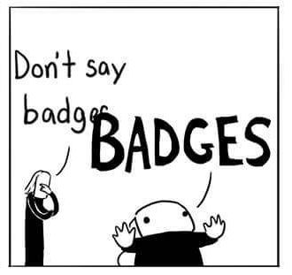

# Badges!

### What are badges?
The badges complement the Ladder - while the Ladder outlines career paths, the badges reward behaviors and achievements we respect and appreciate in our fellows.

### Can I create a badge or achievement?
Sure!
### How?
Simple. Badges must meet the following criteria:
#### 1. A badge achievement must be a measurable, objective, pass fail criteria.
###### Example: **Good speaker**
Do: Prepared an educative talk for an audience of ~50+ people  
Don't: Uploaded a few well-structured presentations

#### 2. A badge must be achievable by one person in reasonable time
###### Example: **Code Review Knight**
Do: Reviewed 100 pull requests, helping his teammates get on the right track  
Don't: Invested 100 hours in reviewing code

#### 3. Badges must reflect behavior that are contributing to the company as well as to the team of the badge winner
###### Example: **Mentor Mage**
Do: Wrote a resourceful documentation for 10 new features  
Don't: Reviewed code while wearing a sparkly robe and pointy hat 1

### What are the badges for?
The Ladder exists to make career progression at Socialbakers engineering department more transparent and easier to understand.  
It outlines desirable patterns of technical excellence, effective thinking patterns, and communication skills.  
There are things that we do, however, that are great and should be celebrated, even when they do not immediately contribute to a career path. Things such as being an exceptional code reviewer, a great presenter, or a wonderful asset to the PO are not a part of the Ladder - and yet, they are important to all of us.  
The badge system is used to highlight these achievements, and allows us all to recognize the good things that you and your colleagues do here.

____

1 That'll be brilliant though, and post pictures on Slack if you do that
